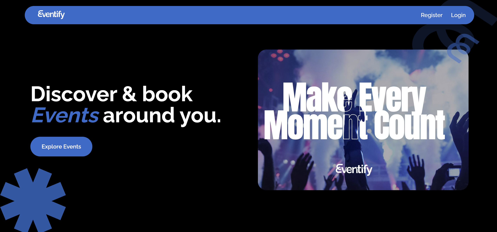
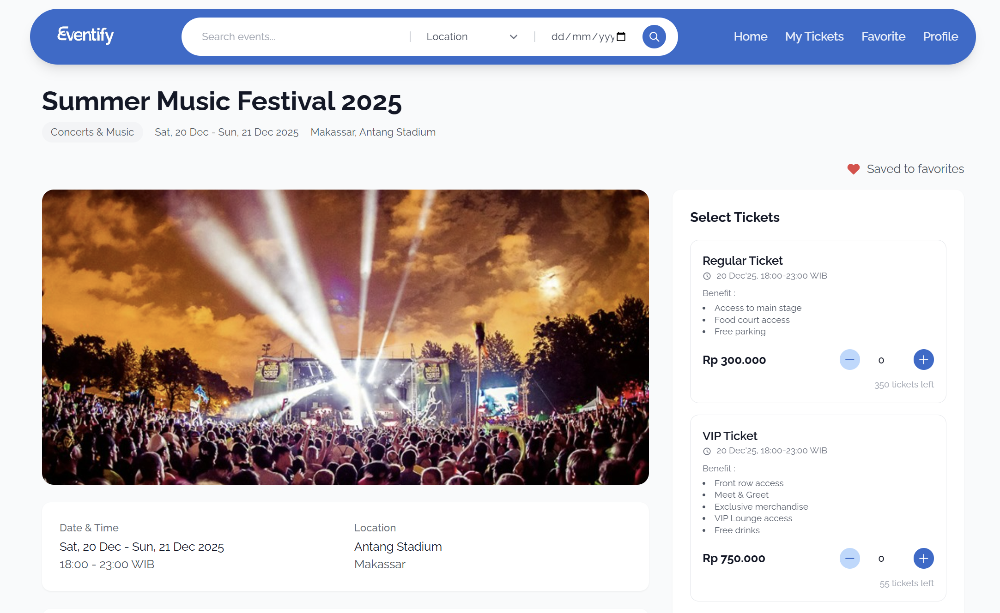
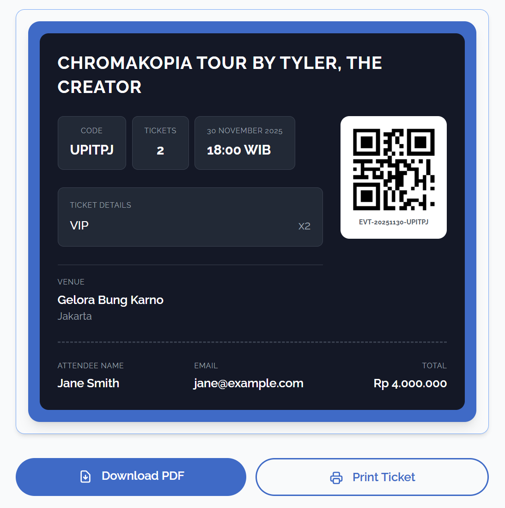
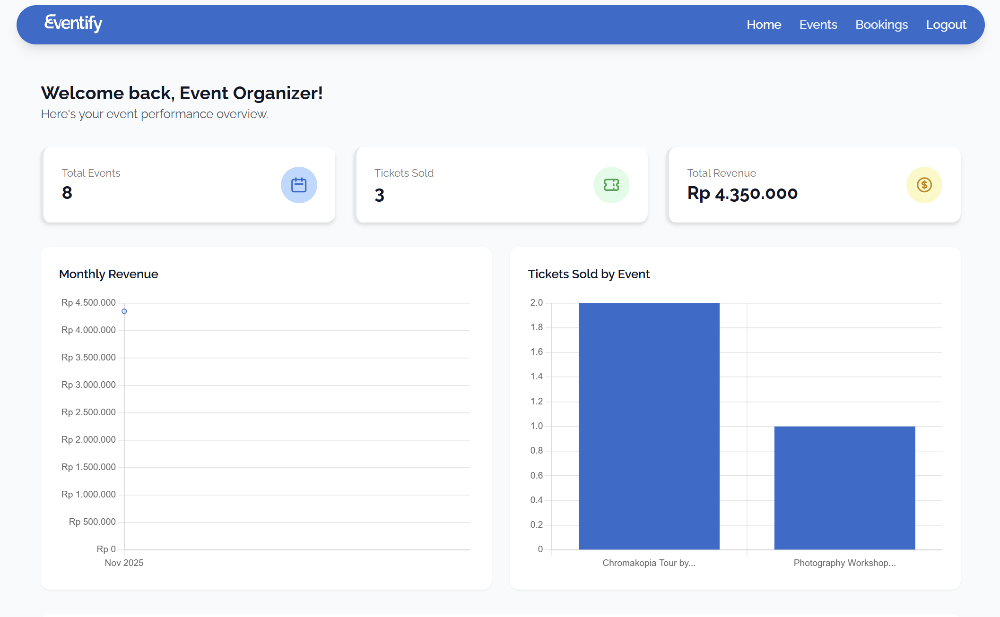

<p align="center">
  
</p>

<h1 align="center">Eventify</h1>

<p align="center">
  <strong>Modern Event Ticket Booking Platform</strong>
</p>

<p align="center">
  <a href="#features">Features</a> •
  <a href="#technology">Technology</a> •
  <a href="#installation">Installation</a> •
  <a href="#usage">Usage</a> •
  <a href="#screenshots">Screenshots</a> •
  <a href="#contributors">Contributors</a>
</p>

<p align="center">
  
  
  
  
</p>

---

## 📖 About Eventify

**Eventify** is a web-based event ticket booking platform that allows users to discover, book, and manage tickets for various types of events such as concerts, conferences, workshops, festivals, and more.

The platform provides three types of accounts with different roles:
- **User** - Search for events, book tickets, and manage bookings
- **Organizer** - Create and manage events, tickets, and view sales reports
- **Admin** - Manage the entire platform including organizer approvals and monitoring

---

## ✨ Features

### 🎫 For Users
| Feature | Description |
|---------|-------------|
| **Event Search** | Search events by name, location, date, and category |
| **Filter & Sorting** | Filter by location, date with calendar picker, and sorting options |
| **Ticket Booking** | Book tickets with various ticket types and quantities |
| **Digital E-Ticket** | View and download tickets in PDF format |
| **Favorite Events** | Save favorite events with toggle love icon |
| **Review & Rating** | Give reviews and ratings after attending events |
| **Cancel Booking** | Cancel bookings with automatic ticket quota refund |
| **Booking History** | View all ticket booking history |

### 🎭 For Organizers
| Feature | Description |
|---------|-------------|
| **Dashboard** | Event statistics, sales, and revenue |
| **Event Management** | Create, edit, and delete events |
| **Ticket Management** | Manage various ticket types per event |
| **Booking Management** | Approve or cancel bookings from users |
| **Sales Reports** | View sales reports with charts |

### 👨‍💼 For Admin
| Feature | Description |
|---------|-------------|
| **Dashboard** | Overall platform statistics |
| **User Management** | Manage all users on the platform |
| **Organizer Approval** | Approve or reject organizer registrations |
| **Event Management** | Monitor and manage all events |
| **Featured Events** | Mark events to be displayed on hero slider |
| **Reports & Export** | Generate reports and export to CSV |

### 🎨 General Features
- ✅ Hero slider with featured events
- ✅ Responsive design for all devices
- ✅ Real-time ticket quota
- ✅ QR Code on e-tickets
- ✅ Multi-role authentication
- ✅ Modern UI with Tailwind CSS

---

## 🛠 Technology

### Backend
- **Laravel 12** - PHP Framework
- **PHP 8.2+** - Programming Language
- **MySQL 8.0** - Database
- **Laravel Breeze** - Authentication

### Frontend
- **Tailwind CSS 3.x** - CSS Framework
- **Blade Template** - Templating Engine
- **Vite** - Build Tool
- **Chart.js** - Charts & Graphs

### Additional Packages
- **DomPDF** - PDF Generation
- **Intervention Image** - Image Processing

---

## 📋 System Requirements

- PHP >= 8.2
- Composer >= 2.0
- Node.js >= 18.x
- NPM >= 9.x
- MySQL >= 8.0
- Git

---

## 🚀 Installation

### 1. Clone Repository
```bash
git clone https://github.com/username/eventify.git
cd eventify
```

### 2. Install Dependencies
```bash
# Install PHP dependencies
composer install

# Install Node.js dependencies
npm install
```

### 3. Configure Environment
```bash
# Copy environment file
cp .env.example .env

# Generate application key
php artisan key:generate
```

### 4. Configure Database

Edit the `.env` file and adjust the database configuration:
```env
DB_CONNECTION=mysql
DB_HOST=127.0.0.1
DB_PORT=3306
DB_DATABASE=eventify
DB_USERNAME=root
DB_PASSWORD=
```

### 5. Migrate & Seed Database
```bash
# Run migrations
php artisan migrate

# Run seeders (optional, for dummy data)
php artisan db:seed
```

### 6. Storage Link
```bash
php artisan storage:link
```

### 7. Build Assets
```bash
# Development
npm run dev

# Production
npm run build
```

### 8. Run Application
```bash
php artisan serve
```

Access the application at: `http://127.0.0.1:8000`

---

## 👤 Demo Accounts

After running the seeder, use the following accounts for testing:

| Role | Email | Password |
|------|-------|----------|
| Admin | admin@eventify.com | password |
| Organizer | organizer@eventify.com | password |
| User | user@eventify.com | password |

---

## 📁 Folder Structure
```
eventify/
├── app/
│   ├── Http/
│   │   ├── Controllers/
│   │   │   ├── Admin/          # Controllers for admin
│   │   │   ├── Organizer/      # Controllers for organizer
│   │   │   ├── User/           # Controllers for user
│   │   │   └── ...
│   │   └── Middleware/         # Custom middleware
│   └── Models/                 # Eloquent models
├── config/
│   └── locations.php           # Indonesian city list
├── database/
│   ├── migrations/             # Database migrations
│   └── seeders/                # Database seeders
├── public/
│   └── images/                 # Static images
├── resources/
│   ├── css/                    # Stylesheets
│   ├── js/                     # JavaScript
│   └── views/
│       ├── admin/              # Views for admin
│       ├── auth/               # Views for authentication
│       ├── components/         # Reusable components
│       ├── events/             # Views for events
│       ├── home/               # Views for home
│       ├── layouts/            # Layout templates
│       ├── organizer/          # Views for organizer
│       └── user/               # Views for user
├── routes/
│   ├── web.php                 # Main routes
│   ├── admin.php               # Admin routes
│   ├── organizer.php           # Organizer routes
│   └── user.php                # User routes
└── storage/
    └── app/public/
        ├── events/             # Event images
        ├── avatars/            # User avatars
        └── tickets/            # Ticket images
```

---

## 🗄 Database Schema

### Entity Relationship Diagram
```
┌──────────────┐     ┌──────────────┐     ┌──────────────┐
│    users     │     │   events     │     │  categories  │
├──────────────┤     ├──────────────┤     ├──────────────┤
│ id           │     │ id           │     │ id           │
│ name         │     │ organizer_id │────>│ name         │
│ email        │     │ category_id  │────>│ slug         │
│ role         │     │ name         │     │ icon         │
│ organizer_   │     │ slug         │     └──────────────┘
│   status     │     │ description  │
└──────────────┘     │ location     │
       │             │ venue        │
       │             │ date_start   │
       │             │ status       │
       │             │ is_featured  │
       │             └──────────────┘
       │                    │
       │                    │
       ▼                    ▼
┌──────────────┐     ┌──────────────┐
│   bookings   │     │   tickets    │
├──────────────┤     ├──────────────┤
│ id           │     │ id           │
│ user_id      │     │ event_id     │
│ booking_code │     │ name         │
│ total_amount │     │ price        │
│ status       │     │ quota        │
└──────────────┘     │ sold         │
       │             └──────────────┘
       │
       ▼
┌──────────────┐     ┌──────────────┐     ┌──────────────┐
│booking_details│    │   reviews    │     │  favorites   │
├──────────────┤     ├──────────────┤     ├──────────────┤
│ id           │     │ id           │     │ id           │
│ booking_id   │     │ user_id      │     │ user_id      │
│ ticket_id    │     │ event_id     │     │ event_id     │
│ quantity     │     │ booking_id   │     │ created_at   │
│ price        │     │ rating       │     └──────────────┘
│ subtotal     │     │ comment      │
└──────────────┘     └──────────────┘
```

---

## 🔐 Roles & Permissions

### User Flow
```
Register → Login → Browse Events → Book Ticket → Wait Approval → Get E-Ticket → Attend Event → Give Review
```

### Organizer Flow
```
Register as Organizer → Wait Admin Approval → Create Event → Add Tickets → Manage Bookings → View Reports
```

### Admin Flow
```
Login → Approve/Reject Organizers → Manage Users → Monitor Events → Set Featured Events → View Reports
```

---

## 📱 Screenshots

### Landing Page


### Event Detail


### E-Ticket


### Admin Dashboard


### Organizer Dashboard


---

## 🧪 Testing
```bash
# Run all tests
php artisan test

# Run tests with coverage
php artisan test --coverage
```

---

## 📄 License

Distributed under the MIT License. See `LICENSE` for more information.

---

## 👨‍💻 Contributors

<table>
  <tr>
    <td align="center">
      <a href="https://github.com/chxnsa">
        
        <br />
        <sub><b>Andi Khaerunnisa Oddang</b></sub>
      </a>
    </td>
  </tr>
</table>

---

## 📞 Contact

- **Email**: anisaandi1980@gmail.com
- **LinkedIn**: [Andi Khaerunnisa Oddang](https://linkedin.com/in/andi-khaerunnisa-oddang-632330280)
- **GitHub**: [@chxnsa](https://github.com/chxnsa)

---

## 🙏 Acknowledgments

- [Laravel](https://laravel.com) - The PHP Framework
- [Tailwind CSS](https://tailwindcss.com) - CSS Framework
- [Chart.js](https://www.chartjs.org) - Charts Library
- [DomPDF](https://github.com/dompdf/dompdf) - PDF Generator

---

<p align="center">
  Made with ❤️ by <a href="https://github.com/chxnsa">Icha</a>
</p>

<p align="center">
  <a href="#eventify">⬆ Back to Top</a>
</p>